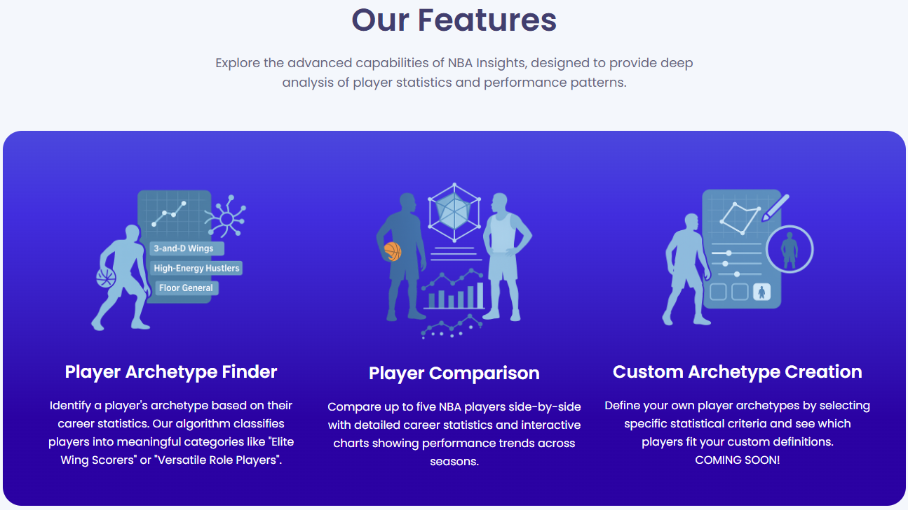
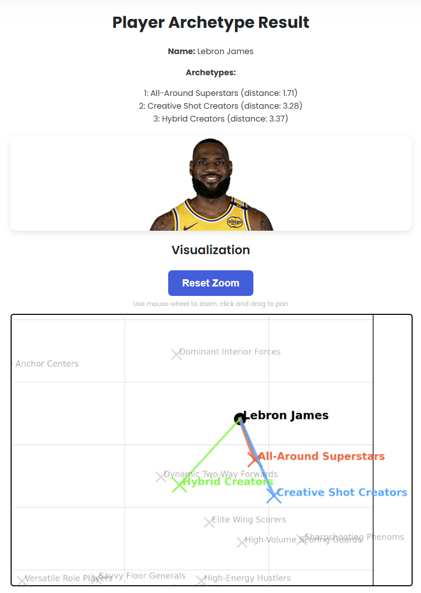
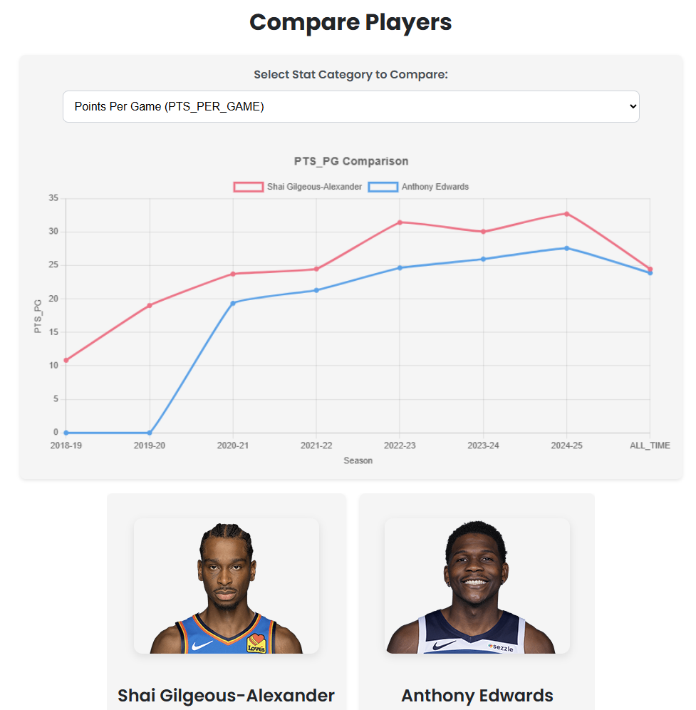

# NBA Insights

A comprehensive web application for analyzing NBA player statistics and classifying players into archetypes!

## 📊 Project Overview

**Purpose**: NBA Insights helps basketball enthusiasts, analysts, and fantasy players understand player performance through data-driven analysis and visualization tools.

**Goal**: Provide meaningful classification of NBA players into archetypes while offering tools to compare players and analyze statistical patterns.

## 🏀 How to Use

### Web Version
**Live**: Click [Here](https://web-production-3f05e.up.railway.app/)!

OR

1. **Install**: Ensure you have the required dependencies (`pip install -r requirements.txt`)
2. **Run**: Execute `python app.py` in your terminal
3. **Play**: Open your browser and navigate to `http://localhost:5000`

## ✨ Features

- **Player Archetype Finder**:
  - Advanced clustering algorithms to classify NBA players
  - Data-driven analysis using career statistics 
  - Multiple archetype identification based on proximity to centroids
  - Interactive visualization of player positioning relative to archetypes

  

- **Player Comparison Tool**:
  - Side-by-side comparison of career statistics
  - Dynamic chart generation for multiple statistical categories
  - Support for comparing up to five players
  - Intuitive visualization of statistical differences

    

- **Custom Archetype Creation** (Coming Soon):
  - User-defined criteria for custom player archetypes
  - Personalized statistical thresholds
  - Advanced filtering based on selected parameters
  - Custom visualization of player-archetype matching

- **Technical Foundation**:
  - Object-oriented design using Python
  - Flask web framework for the application
  - NBA API integration for real-time data
  - Efficient data caching to minimize API calls
  - Responsive web interface with interactive elements

## 🔍 Archetypes

The application uses clustering algorithms to classify players into archetypes such as:
- All-Around Superstars
- High-Volume Scoring Guards
- Dominant Interior Forces
- Versatile Role Players
- Savvy Floor Generals
- And many more!

Each archetype is defined by a centroid in a multi-dimensional statistical space, and players are matched to archetypes based on their proximity to these centroids.

## 🛠️ Technical Details

- **Backend Framework**:
  - **Flask**: Powers the web development, routing, and session management
  - **Python**: Core language for data processing, ML model implementation, and API integration

- **Data Acquisition & Processing**:
  - **nba_api**: Enables retrieval of comprehensive NBA player statistics via NBA's official data sources
  - **Pandas**: Handles data manipulation, cleaning, and preprocessing of player statistics
  - **NumPy**: Provides mathematical operations, array manipulation, and numerical computing capabilities

- **Machine Learning Implementation**:
  - **Scikit-learn**: Powers the machine learning pipeline for player classification
  - **Gaussian Mixture Models (GMM)**: Advanced probabilistic clustering algorithm to create player archetypes
  - **PCA (Principal Component Analysis)**: Dimensionality reduction technique for visualizing high-dimensional player statistics
  - **Standardization**: Feature scaling to normalize player statistics before clustering

- **Data Storage & Caching**:
  - **JSON**: Stores predefined centroids in `data/archetype_centroids.json`
  - **Pickle**: Serializes trained ML models (scaler and PCA) in `data/scaler.pkl` and `data/pca.pkl`
  - **In-memory caching**: Reduces API calls by storing player data during session
  - **Player statistics cache**: Implements a dictionary-based caching mechanism to avoid redundant API requests

- **Visualization**:
  - **Matplotlib**: Creates static graphs for showing player positioning relative to archetypes
  - **Chart.js**: Powers interactive, responsive data visualizations for player comparisons in the web interface
  - **2D Projection**: Complex statistical profiles visualized in comprehensible 2D space
  - **Interactive elements**: Zoom, pan, and hover functionalities in web-based charts

- **Frontend Technologies**:
  - **HTML/CSS**: Structures and styles the web interface
  - **JavaScript**: Enables dynamic content updates and user interactions
  - **Bootstrap**: Provides responsive design components and layout system
  - **WOW.js**: Implements scroll-based animations for enhanced user experience

## ⚠️ Disclaimer

This application is not affiliated with or endorsed by the National Basketball Association (NBA). All data is sourced from public APIs, including [nba_api](https://github.com/swar/nba_api).

